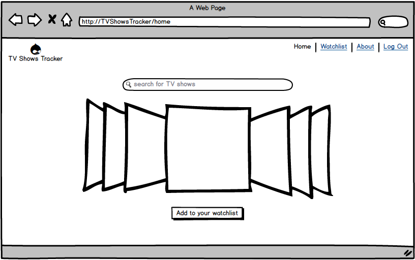
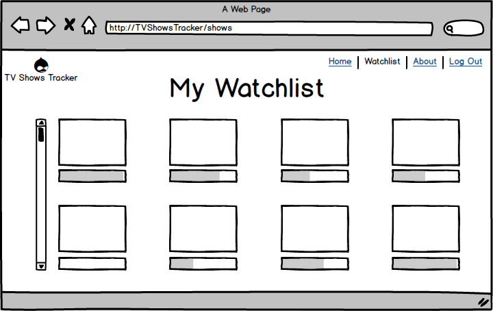

# TV Shows Tracker

## Introduction

The user can keep track of the shows she is watching and ones she liked most, view what her friends are watching and get recommendations.

## Overview

1. User can search for shows and add them to her watchlist.
2. Watchlist contains clickable links of the shows the user is currently watching or wants to watch. Each show includes a completion bar and a general sentiment indicator.
3. Clicking on a link takes the user to that show's show page.
4. The show page lists all seasons of the show and has completion bars under each season.
5. Clicking on a season displays a list of that season's episodes with checkboxes/heart icons next to them indicating whether the user has watched/liked that particular episode.   

## Stack

1. React front-end with Rails back-end
2. Semantic UI react
3. Animate JS / Charts JS
4. TVMaze API / TheTVDB API 

## Wireframe

## Trello

[Trello Link](https://trello.com/b/l0dVETE2/tvshowstracker)
